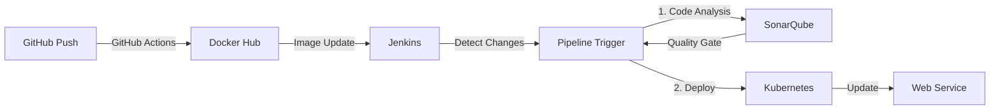

# 🚀 DevSecOps 프로젝트

<div align="center">


보안을 고려한 CI/CD 파이프라인과 모니터링 시스템을 구축하여 안전하고 효율적인 개발 환경을 제공합니다.

</div>

## 📋 목차
- [개요](#-개요)
- [기술 스택](#-기술-스택)
- [CI/CD 파이프라인](#-cicd-파이프라인)
- [시스템 구성](#-시스템-구성)
- [설치 방법](#-설치-방법)
- [접속 정보](#-접속-정보)
- [주의 사항](#-주의-사항)

## 🎯 개요
DevSecOps 방법론을 적용한 웹 애플리케이션 개발 및 운영 환경 구축 프로젝트입니다.

### 주요 기능
- 🔄 자동화된 CI/CD 파이프라인
- 🛡️ 보안 취약점 자동 스캔
- 📊 코드 품질 분석
- 📈 실시간 모니터링
- 📝 중앙 집중식 로깅

## 🛠 기술 스택
| 분류 | 기술 |
|------|------|
| **컨테이너 오케스트레이션** |  (Kind) |
| **CI/CD** |  |
| **코드 품질** |  |
| **모니터링** |  |
| **웹 서비스** |   |
| **버전 관리** |   |

## 🔄 CI/CD 파이프라인



### 파이프라인 단계
1. **소스 코드 변경**
   - GitHub 저장소에 코드 푸시
   - GitHub Actions 워크플로우 실행

2. **도커 이미지 빌드**
   - GitHub Actions에서 자동 빌드
   - Docker Hub에 이미지 푸시
   - 태그: latest

3. **Jenkins 파이프라인**
   - Docker Hub 이미지 변경 감지
   - 자동 파이프라인 트리거
   - 단계:
     ```groovy
     stage('Code Analysis') {
         // SonarQube 코드 분석
     }
     stage('Deploy') {
         // Kubernetes 배포
         // web-service.bat 실행 또는
         // kubectl apply -f web-deployment.yaml
     }
     ```

4. **배포 프로세스**
   - 최신 이미지로 웹 서비스 업데이트
   - 무중단 배포 (Rolling Update)
   - 상태 모니터링

## 🏗 시스템 구성
### 노드 구성
| 노드 | 용도 | 레이블 |
|------|------|---------|
| `worker1` | 웹서버 | `node-type: webserver` |
| `worker2` | Jenkins/SonarQube | `node-type: jenkins` |
| `worker3` | 백업 DB | `node-type: backup-db` |
| `worker4` | ELK 스택 | `node-type: elk` |
| `worker5` | 로그 DB | `node-type: log-db` |
| `worker6` | 웹 DB | `node-type: web-db` |

## 📥 설치 방법
### 사전 요구사항
- Docker Desktop
- Git
- Windows 운영체제

### 설치 순서
1. **클러스터 초기화 및 생성**
```powershell
cd Kubernetes
.\reset-cluster.bat
.\deploy.bat
```

2. **Jenkins 배포**
```powershell
cd ../Jenkins
.\jenkins-service.bat
```

3. **SonarQube 배포**
```powershell
cd ../SonarQube
.\sonarqube-service.bat
```

4. **ELK 스택 배포**
```powershell
cd ../ELK
.\ELK.bat
```

5. **웹 서비스 배포**
```powershell
cd ../Web
.\web-service.bat
```

## 🔗 접속 정보
### 서비스 엔드포인트
| 서비스 | URL | 포트(내부/외부) | 설명 |
|--------|-----|-----------------|------|
| Jenkins UI | http://localhost:30800 | 8080/30800 | CI/CD 파이프라인 관리 |
| Jenkins JNLP | - | 50000/30850 | Jenkins 에이전트 통신 |
| SonarQube | http://localhost:30900 | 9000/30900 | 코드 품질 분석 |
| Kibana | http://localhost:30601 | 5601/30601 | 로그 시각화 |
| Elasticsearch | http://localhost:30920 | 9200/30920 | 검색 & 분석 엔진 |
| Logstash | - | 5044/5044 | 로그 수집 |
| 웹 서비스 | http://localhost:30080 | 30080/30080 | 메인 웹 애플리케이션 |

## ⚠️ 주의 사항
1. Jenkins와 SonarQube는 worker2 노드에서 실행
2. 웹 서비스는 worker1 노드에서 실행
3. ELK 스택은 worker4 노드에서 실행 (향후 Wazuh로 변경 예정)
4. 각 서비스의 데이터는 기본적으로 emptyDir 사용

## 📚 참고 자료
- [웹 서비스 소스](https://github.com/GH6679/web_wargamer.git)